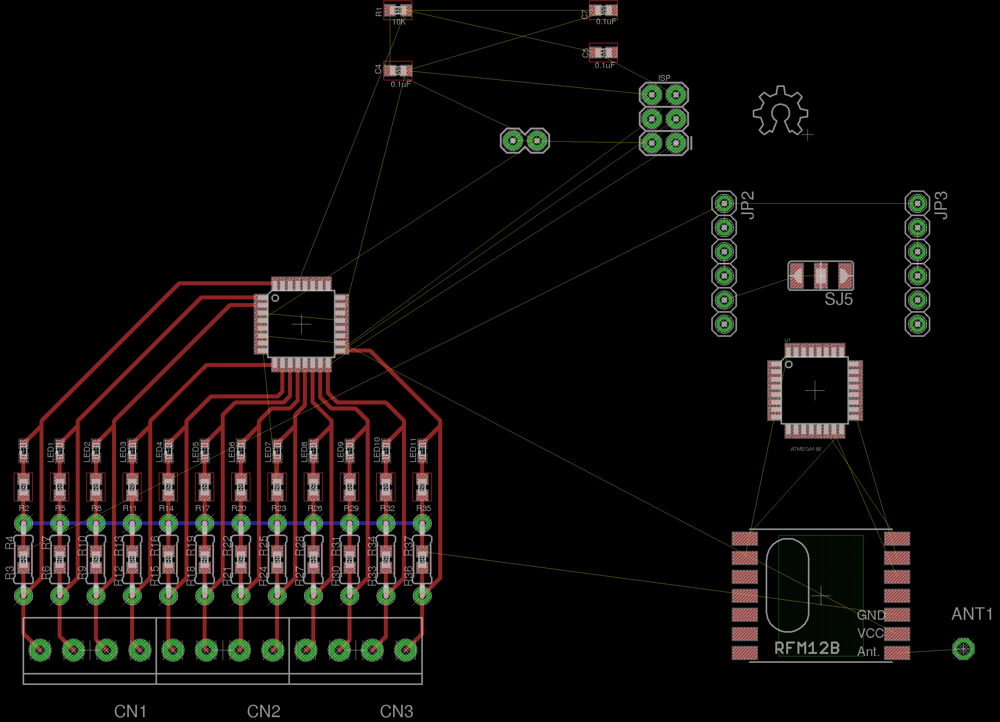

## 12 Input Pulse Counter

This is a design in development for a 12-input puse counter for interfacing with 12 utility meters.

Many meters have pulse outputs, including electricity meters: single phase, 3-phase, import, export.. Gas meters, Water flow meters etc

The pulse output may be a flashing LED or a switching relay (usually solid state) or both.

In the case of an electricity meter a pulse output corresponds to a certain amount of energy passing through the meter (Kwhr/Wh). For single-phase domestic electricity meters (eg. Elster A100c) each pulse usually corresponds to 1 Wh (1000 pulses per kwh).  For the case of higher power meters (often three-phase) each pulse corresponds to a greater amount of energy eg. 2whr per pulse or even 10whr per pulse. 

Full intorduction to pulse counting: [Building Blocks > Pulse counting](http://openenergymonitor.org/emon/buildingblocks/introduction-to-pulse-counting)

The usual way to do pulse counting on the Arduino is to use the 2 Interrupt pins but this limits us to 2 meters. The following hardware design is for a 12 input arduino based pulse counter that runs firmware that samples all the arduino digital input pins at high sample rate. For full details including arduino source code see: [Building Blocks > 12 input pulse counting](http://openenergymonitor.org/emon/buildingblocks/12-input-pulse-counting)

### Eagle schematic and board file

Download both the schematic and board file and open in eagle, click on File > Switch to Board to navigate between schematic view and PCB Board view.

- Schematic: [12input.sch](12input.sch)
- Board: [12input.brd](12input.brd)

### Schematic

### Board

